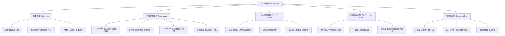

# PromptFlow 产品需求规格说明书 (PRD)

> 版本：v1.0 | 状态：待确认 / 立项完成 | 负责人：Solo Founder & Commercial Strategist

---

## 1. 商业立项与可行性审查 (Step 0)

### 1.1 合法合规一票否决检查 (Compliance Gate)
- **行业资质**：本项目为**离线生产力工具软件**，不提供中心化内容分发、内容审核或媒体发布功能，不涉及增值电信业务牌照（ICP/EDI）限制。
- **数据隐私与合规**：
  - 核心执行 **Local-first（本地优先）** 原则：所有脚本、录音文件、拍摄视频均在用户设备本地沙盒存储，不设云端中继服务器，零隐私泄露风险。
  - 符合《个人信息保护法》与 GDPR：无需注册登录账号、无设备唯一标识收集、无第三方追踪 SDK。
  - 权限极简申请：按需动态申请 `CAMERA`、`RECORD_AUDIO`、`SYSTEM_ALERT_WINDOW`，并给出清晰用途告知弹窗。
- **合规结论**：通过一票否决审查，合规风险极低。

### 1.2 五维商业决策推演 (5-D Commercial Engine)
1. **真伪痛点检验**：
   - **痛点**：创作者录视频记不住词、眼睛总看向屏幕偏角显得不专业；录播客/有声书念稿频繁卡壳、换气错乱；第三方剪辑工具提词器广告冗长、强迫登录、悬浮窗容易被系统杀后台。
   - **替代方案对比**：
     - 传统实体提词板：价格 300~1500 元，需专用分光镜，便携度为 0。
     - 市面主流 App（如剪映提词器、爱提词等）：功能臃肿、大量引导年费订阅（¥128~198/年）、频繁推送弹窗、缺乏纯音频高保真录制模式。
   - **迁移阻力**：极低。创作者只需一个“干净、不闪退、调速丝滑、直视镜头”的工具。
2. **单位经济测算 (Unit Economics)**：
   - 架构：Local-first 纯客户端（未来云同步选型由用户自填 WebDAV / Google Drive / iCloud 或通过低成本 Serverless 处理）。
   - 单用户边际服务器成本：**¥0.00 / 月**。
   - 毛利率：**> 95%**（扣除应用商店分成与支付手续费后净结余）。
3. **变现与付费墙设计 (Paywall Strategy)**：
   - **商业模式**：Freemium + 一次性买断制（或终身 VIP 许可），契合独立工具软件受众心理。
   - **免费核心**：应用内无限次视频提词、无限次音频提词、基础悬浮窗、无限台本字数、基础调速。
   - **Pro 付费卡点 (AHA 时刻后触发)**：
     - 4K 60FPS 超清视频输出与自定义比特率；
     - 蓝牙遥控器 / 实体按键深度映射（自拍杆、PPT 笔无线控制）；
     - 眼神注视优化带（智能镜头邻近折射布局）；
     - 台本智能断句标记与语气停顿节拍器；
     - 音频降噪算法处理与多格式（WAV / FLAC）无损导出。
4. **分发与冷启动杠杆 (Distribution & GTM)**：
   - **前 100 个精准用户**：
     - 酷安社区（极客与自媒体创作者集聚地）：发布“极简无广告、纯本地安卓提词器”首发帖；
     - 即刻（AIGC / 独立开发者圈子）：图文分享产品演进与开发日志；
     - 小红书 / 视频号：录制对比短视频（“手机提词眼神飘？教你一招让提词器贴着摄像头”）。
   - **病毒自传播机制**：导出的视频支持选择开启微小可爱的“PromptFlow 极简片尾”（默认可免费关闭，但鼓励分享者带 tag 赢取 Pro 体验码）。

---

## 2. 用户角色与典型场景 (User Stories)

### 场景 A：口播短视频录制 (Video Teleprompter)
- **用户**：博主“小李”，需每天录制 3 条 2 分钟以内的口播知识干货。
- **痛点**：背稿耗时 1 小时，用别的提词器眼神一直在看屏幕中间，粉丝评论“眼神飘、不看镜头”。
- **流程**：
  1. 在 PromptFlow 中粘贴 600 字文案；
  2. 启动“视频录制提词”模式；
  3. 将提词文本框微调吸附在**前置摄像头打孔屏正下方**，宽度收窄至 60% 屏幕宽度（大幅减小眼球转动幅度）；
  4. 开启 3 秒倒计时，自动匀速滚动并同步录制 1080P 视频；
  5. 录制完毕自动保存至系统相册，即录即用。

### 场景 B：播客 / 广播剧 / 旁白录音 (Audio Teleprompter)
- **用户**：播客主播“王老师”，录制 20 分钟单人独白播客。
- **痛点**：很多手机提词器必须开相机，录半小时手机发热严重、掉电极快；普通录音机又没有提词功能，需要两台设备（一台看稿一台录音）。
- **流程**：
  1. 导入数千字大纲或长文；
  2. 启动“纯音频录制提词”模式；
  3. 界面仅保留大字号提词滚动区、录音时长、实时动态声波振幅与暂停/打点按钮；
  4. 录制完成输出高保真 `.m4a` 或 `.wav` 音频文件，支持一键分享到剪辑软件或电脑。

### 场景 C：第三方相机 / 直播推流悬浮提词 (Floating Teleprompter)
- **用户**：带货主播 / 抖音达人“阿芳”，习惯使用抖音自带美颜滤镜拍摄，或者在微信视频号直播。
- **痛点**：应用内相机美颜效果不如原生短视频 App，必须跨软件提词。
- **流程**：
  1. 打开 PromptFlow 悬浮窗开关，最小化至侧边栏小圆球；
  2. 打开抖音开播或录制界面；
  3. 展开半透明悬浮窗，调整透明度至 70%，移动到镜头边缘；
  4. 点击悬浮窗的“开始滚动”按钮，一边美颜直播一边顺畅念词。

---

## 3. 功能架构与特性清单 (Features Matrix)

### 3.1 核心功能详述

| 功能编号 | 模块 | 功能名称 | 免费/Pro | 核心逻辑说明 |
| :--- | :--- | :--- | :--- | :--- |
| **F-01** | 台本 | 极简台本编辑器 | 免费 | 支持富文本标记（标黄重点字）、字数统计、按 200 字/分钟预估朗读时长 |
| **F-02** | 台本 | 外部文本秒级导入 | 免费 | 剪贴板快速粘贴、TXT 文件直读解析 |
| **F-03** | 视频 | 贴镜式视频提词 | 免费 | 文本宽度自由限宽（如居中 50% 宽度并贴顶），强迫眼球直视摄像头打孔孔位 |
| **F-04** | 视频 | 录制规格配置 | 免费/Pro | 免费版支持 720P/1080P 30FPS；Pro 支持 4K 60FPS 及自定义码率 |
| **F-05** | 视频 | 提词镜像模式 | 免费 | 水平镜像/垂直镜像，适配物理外接分光玻璃提词夹具 |
| **F-06** | 音频 | 纯音频高保真录制 | 免费 | 支持 AAC/M4A 格式，显示实时分贝波动与波形指示条 |
| **F-07** | 音频 | 纯音频防误触息屏/低功耗 | 免费 | 录音时降低屏幕刷新率与亮度，超长播客录制不掉电 |
| **F-08** | 悬浮窗 | 可拖拽画中画悬浮窗 | 免费 | 任意 App 之上浮动，支持一键缩小成气泡图标，支持透明度滑块 |
| **F-09** | 控制 | 蓝牙外设无感遥控 | Pro | 拦截物理音量键或蓝牙自拍杆按键，单击暂停/播放，双击回退 5 秒 |
| **F-10** | 控制 | 倒计时与定速巡航 | 免费 | 3/5/10 秒录制预备倒计时；速度支持 10~100 行/分钟无级调节 |

---

## 4. 权限与防护机制 (Defensive Android Architecture)

1. **`android.permission.CAMERA`**：
   - 仅在用户进入视频录制提词页时触发请求，提供“仅在使用中允许”友好指引。
2. **`android.permission.RECORD_AUDIO`**：
   - 音频录制与视频录制共享，如果用户拒绝，弹窗明确提示“提词仍可正常滚动，但无法输出声音”。
3. **`android.permission.SYSTEM_ALERT_WINDOW`**：
   - 悬浮窗提词专属权限，引导跳转系统原生“在其他应用上层显示”设置页，提供返回回调校验。
4. **存储与相册权限**：
   - 适配 Android 10 (Q) 及以上 `Scoped Storage` 分区存储机制，视频直接通过 `MediaStore.Video` 写入，音频通过 `MediaStore.Audio` 写入，**无需申请危险的全局读取外部存储权限**。
